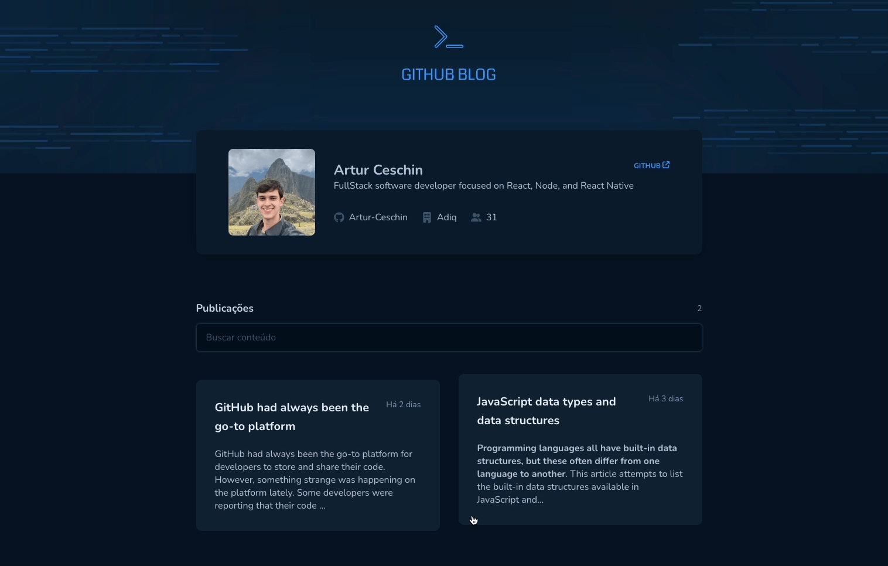

<h1 align="center">
  
</h1>




<h1 align="center">
    GitHub Blog
</h1>
<p align="center">Search by contents from GitHub</p>

## About this project

This project was created to work as a personal blog, using issues from this repository as content. Please fill free to add comments if you like.

---

## Project UI 🎨

- [Figma - GitHub Blog](https://www.figma.com/community/file/1138814951106121051)

## Technologies 👩‍💻

Technologies used in this project

- [ReactJS](https://reactjs.org/)
- [TypeScript](https://www.typescriptlang.org/)
- [Styled Components](https://styled-components.com/)
- [React Router Dom](https://reactrouter.com/en/main)
---

## Requirements 💻

It is necessary to have installed on your machine

- [Git](https://git-scm.com/)
- [Node](https://nodejs.org/en/)


## Starting 🚀

```bash
# Clone this project
$ git clone https://github.com/Artur-Ceschin/GitHub-Blog

# Access
$ cd github-blog

# Install dependencies
$ yarn

# Run the project
$ yarn dev

# The server will initialize in the <http://localhost:4001>
```

---

## License 📃

This project is under license from MIT. For more details, see the [LICENSE](./LICENSE) file.

### Author

---

Made with ❤️ by Artur Ceschin 👋🏼 Please fell free to contact me!
<br/>
[](https://www.linkedin.com/in/artur-peres-ceschin-programador/)
[](mailto:artur.ceschin@gmail.com)